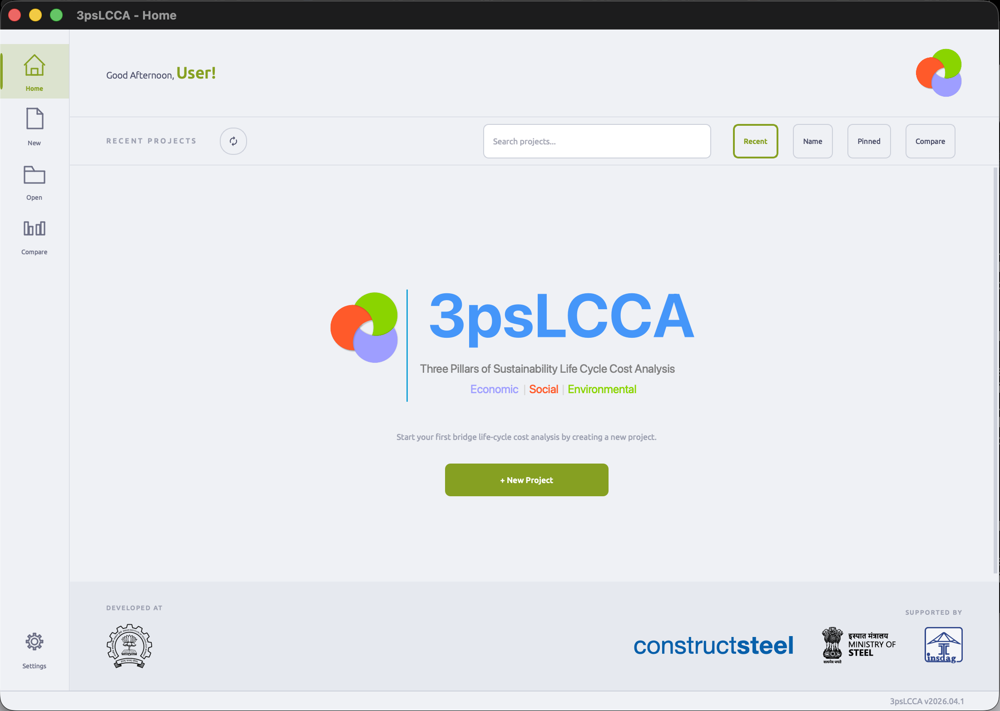

  

<h1 align="center">3psLCCA</h1>

<em>Three Pillars of Sustainability Life Cycle Cost Analysis</em>

  
  
  

A graphical, bridge-specific Life Cycle Cost Assessment tool that folds the **economic**,
**environmental**, and **social** cost of a bridge across its full service life into one
comparable, monetary metric.

  

## About this repo

This repo holds the [Docusaurus](https://docusaurus.io/) source for the project homepage and
docs **not** the desktop app itself.
| | |
|---|---|
| App | [3psLCCA-gui](https://github.com/3psLCCA/3psLCCA-gui) |
| Engine | [3psLCCA-core](https://github.com/3psLCCA/3psLCCA-core) |
| Docs source | [`docs/`](./docs) |
| Homepage source | [`src/pages/index.tsx`](./src/pages/index.tsx) |

Found an error on a page? Edit the file above and open a PR.
